## Overview

[Cobalt Strike](https://attack.mitre.org/software/S0154/) is a premium offensive security tool leveraged by penetration
testers and red team members as a way to emulate adversary behavior. The goal is to validate security detection capabilities
and processes replicating a real-world intrusion. While Cobalt Strike is a legitimate tool, it is often
[abused by actual threat actors](https://www.proofpoint.com/uk/blog/threat-insight/cobalt-strike-favorite-tool-apt-crimeware)
as a way to gain and maintain persistence into targeted networks.

To manage command and control, Cobalt Strike leverages an implant that uses beacon configuration  known as a
[Malleable Command and Control](https://www.cobaltstrike.com/help-malleable-c2) (Malleable C2) profile. A Malleable C2
profile contains a tremendous number of options to configure the beacon's functionality, please see
[Cobalt Strike's official documentation](https://www.cobaltstrike.com/help-beacon) for specifics on configuring Malleable
C2 beacons.

This blog will focus on using the Elastic Stack to collect Cobalt Strike beacon payloads, extract and parse the beacon
configurations, and an analysis of the metadata within the configurations. This will all be taken from the memory of
targeted Windows endpoints that we've collected from our telemetry.

## The Fleet Policy

[Fleet](https://www.elastic.co/guide/en/kibana/current/fleet.html) is an app in Kibana that provides a central place to
configure and monitor your Elastic Agents. Fleet uses [integrations](https://www.elastic.co/guide/en/fleet/current/integrations.html),
which are unified plugins that allow data to be collected from apps and services, and then stored in Elasticsearch. Integrations
are added to policies, and Elastic Agents are added to policies.

First, we need to configure the collection of shellcode and malicious memory regions in a Fleet policy. This will
collect 4MB of data from memory surrounding shellcode and malicious memory events. It should be noted that this
collection may significantly increase the amount of data stored in Elasticsearch.

You can add this to an existing policy or create a new policy. To create a new policy, in Kibana, navigate to Fleet →
Agent Policies → Create agent policy. Give your policy a name and description. Optionally, you can disable "System monitoring"
and "Agent monitoring" to reduce the amount of system and agent metadata collected from your endpoints. Click on
"Create agent policy".

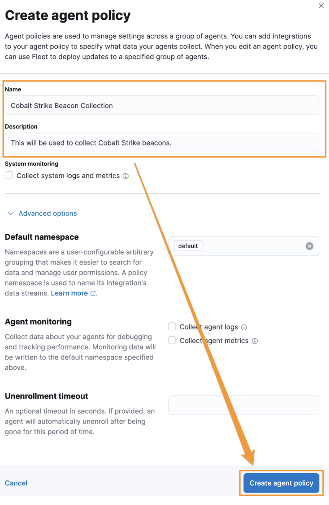{ width="500em"}

Next, click on your new policy and click the "Add integration button.

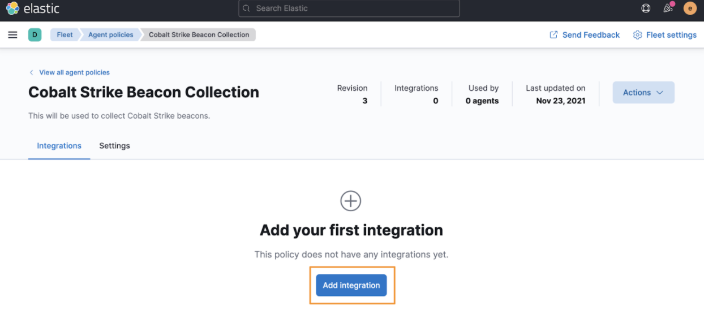

In the search box, type "security" and select "Endpoint Security".

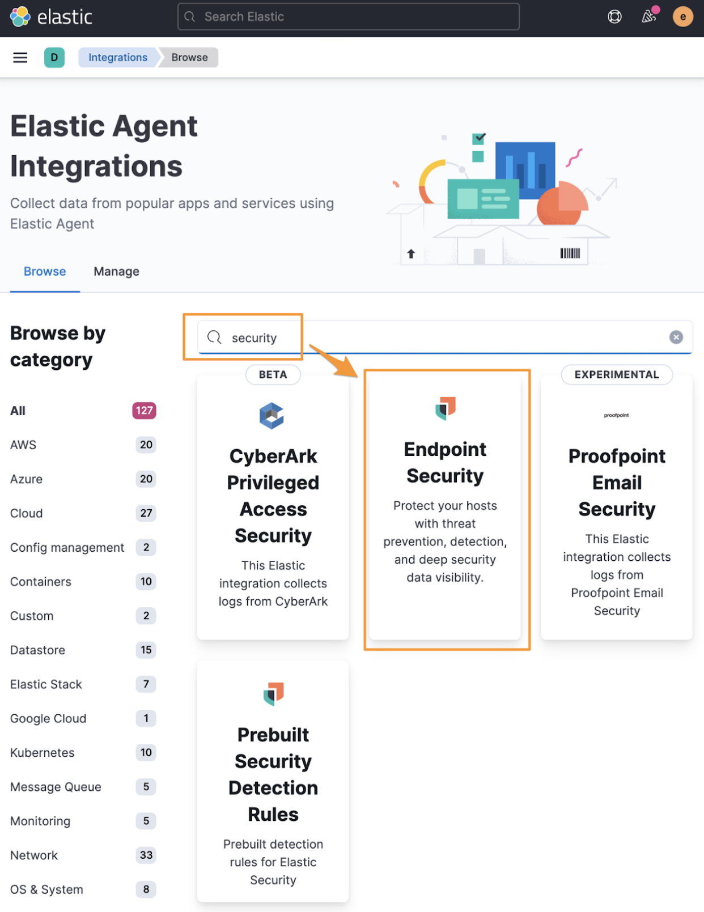

Next, click the "Add Endpoint Security" button.

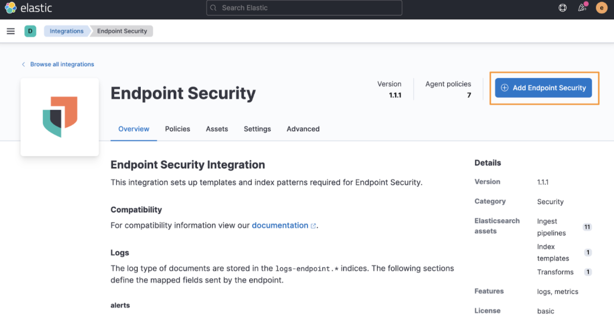

Next, you'll give the integration a name and description, and then click "Save integration".

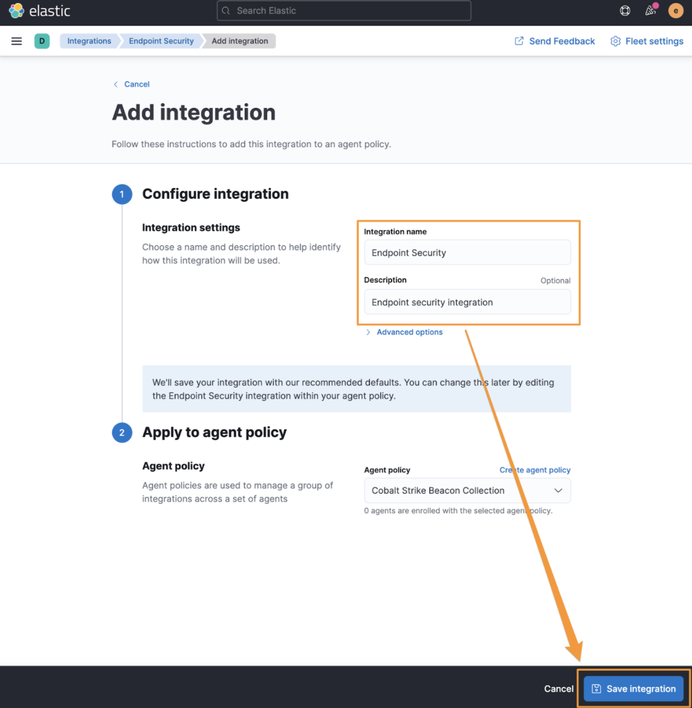

Finally, we're going to add the memory and shellcode collection options. Click on the integration name ("Endpoint Security").

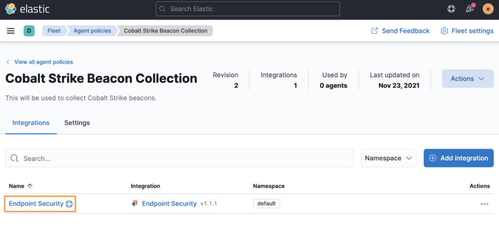

Under "Protections", leave the different protection types selected, but change the Protection level from "Prevent" to
"Detect". This will allow malware to continue to run to allow for more rich event collection. There are several types
of Protections (Malware, Memory, etc.), select "Detect" for each type that has Windows as an available "Operating system";
you can uncheck Mac and Linux Operating Systems.
**If you are enabling this feature for a production environment, leave the Protection levels as "Prevent"**

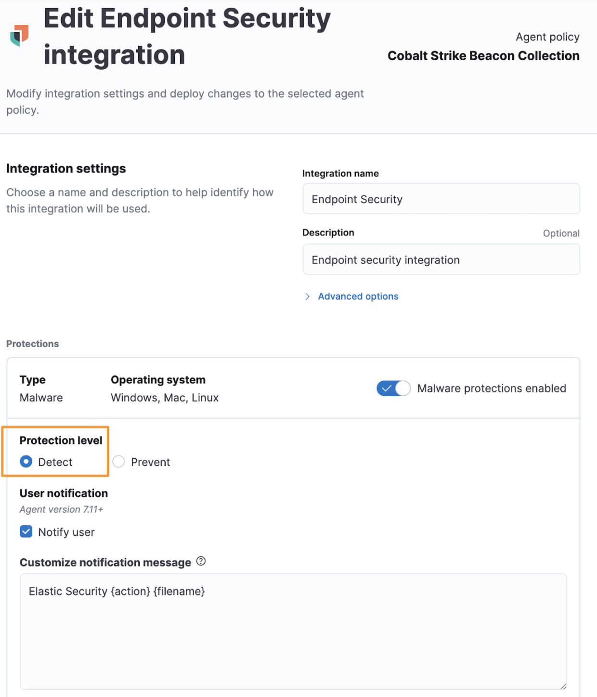

At the bottom of the integration configuration page, you can toggle "Register as antivirus" so that the Elastic Agent is
registered as the Antivirus solution, and disable Windows Defender. Click on "Show advanced settings".

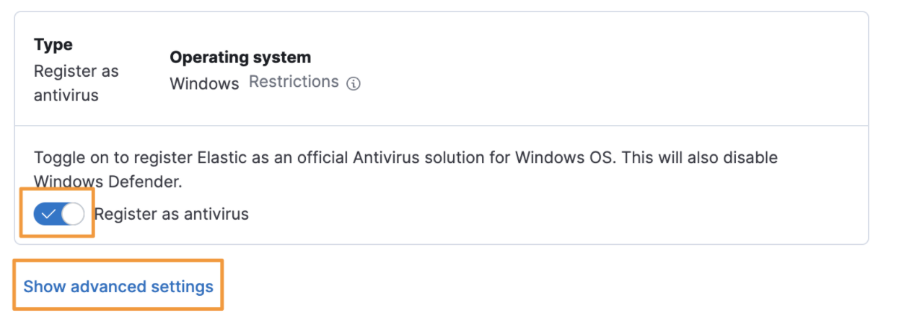

At the very bottom of the advanced settings page, type "true" for the `windows.advanced.memory_protection.shellcode_collect_sample`
and `windows.advanced.memory_protection.memory_scan_collect_sample` settings, and then click "Save integration".

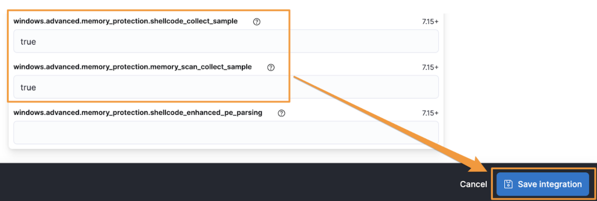

Once you have created this specific Fleet policy, you can apply this policy to an endpoint running the Elastic Agent. For
specific instructions on how to deploy the Elastic Agent, refer to the
[official Elastic documentation](https://www.elastic.co/guide/en/fleet/current/elastic-agent-installation.html#install-fleet-managed-agent).

## Collecting the Beacon

Now that we've made a collection policy and applied it to a Windows machine you can target it with a CobaltStrike
campaign. Instead of mimicking what a CobaltStrike beacon could look like in a lab, we're going to use live CobaltStrike
 beacon payloads from Elastic's telemetry.

To find Cobalt Strike beacon payloads, you can use the Discover app in Kibana to return events identified as Cobalt Strike.
These events are provided by the Elastic Endpoint Security Agent, which identifies Cobalt Strike beacons and modules with
the "Windows.Trojan.CobaltStrike" malware signature. A simple
[Kibana Query Language (KQL)](https://www.elastic.co/guide/en/kibana/current/kuery-query.html) search is as simple as:

```text title="KQL search for Cobalt Strike"
event.category:(malware or intrusion_detection) and
rule.name:(Windows.Trojan.CobaltStrike or Windows.Trojan.Cobaltstrike)
```

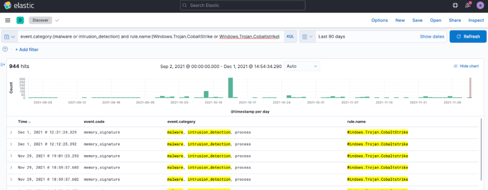

Next, let's filter on documents that have the `process.Ext.memory_region.bytes_compressed` field (this is a field
populated by the `windows.advanced.memory_protection.shellcode_collect_sample` and
`windows.advanced.memory_protection.memory_scan_collect_sample` settings we configured in the Fleet policy above).
To do that we can simply add a filter for the `process.Ext.memory_region.bytes_compressed_present` field with a value
of `true`.

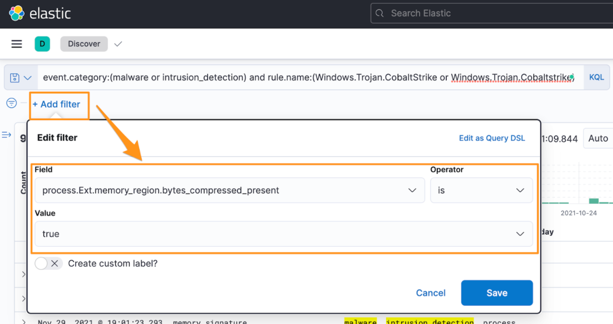

Finally, add the `process.Ext.memory_region.bytes_compressed` field to our view so that we can see the value of the field.

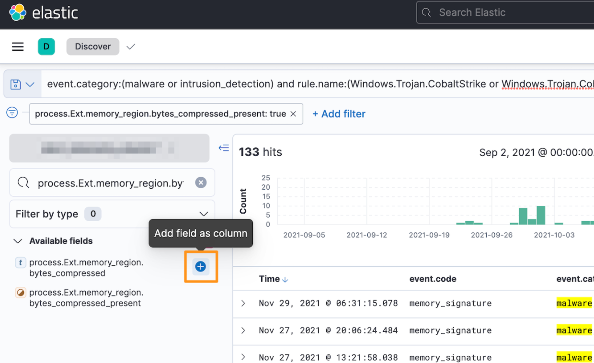

We can see that we have 133 examples with data in the `process.Ext.memory_region.bytes_compressed` field. This field
contains the file extracted from the memory of the infected host and then zlib deflated and Base64 encoded..

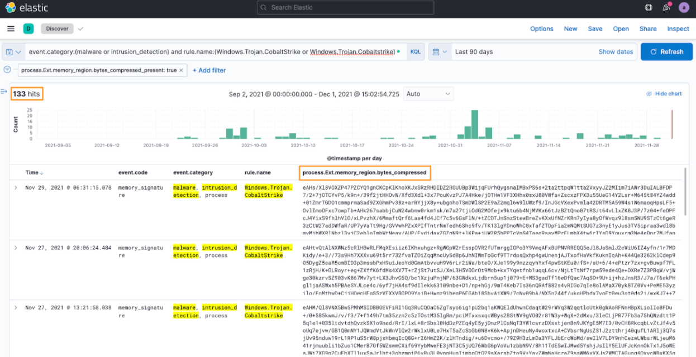

Now that we've collected the file in the Elastic Stack, let's turn that raw data into a file that we can analyze.

There is a lot of nuance between operating systems on how to decode Base64 and inflate zlib deflated files. If you'd
prefer to use your command line or local tools, feel free to do so. That said, [CyberChef](https://gchq.github.io/CyberChef)
is a browser-based data parser that is provided for free by the United Kingdom's Government Communications Headquarters (GCHQ).

Using the CyberChef web application, add the "From Base64" and "Zlib Inflate"
[recipes](https://gchq.github.io/CyberChef/#recipe=From_Base64('A-Za-z0-9%2B/%3D',true)Zlib_Inflate(0,0,'Adaptive',false,false))
and then paste the contents of the `process.Ext.memory_region.bytes_compressed` field into the "Input" section. This
will decode the Base64 encoded string and inflate the zlib archive. There are more recipes that we could add, like
"Strings", but we'll download the actual beacon payload binary and do some local analysis.

Click on the disk icon to download the inflated binary.

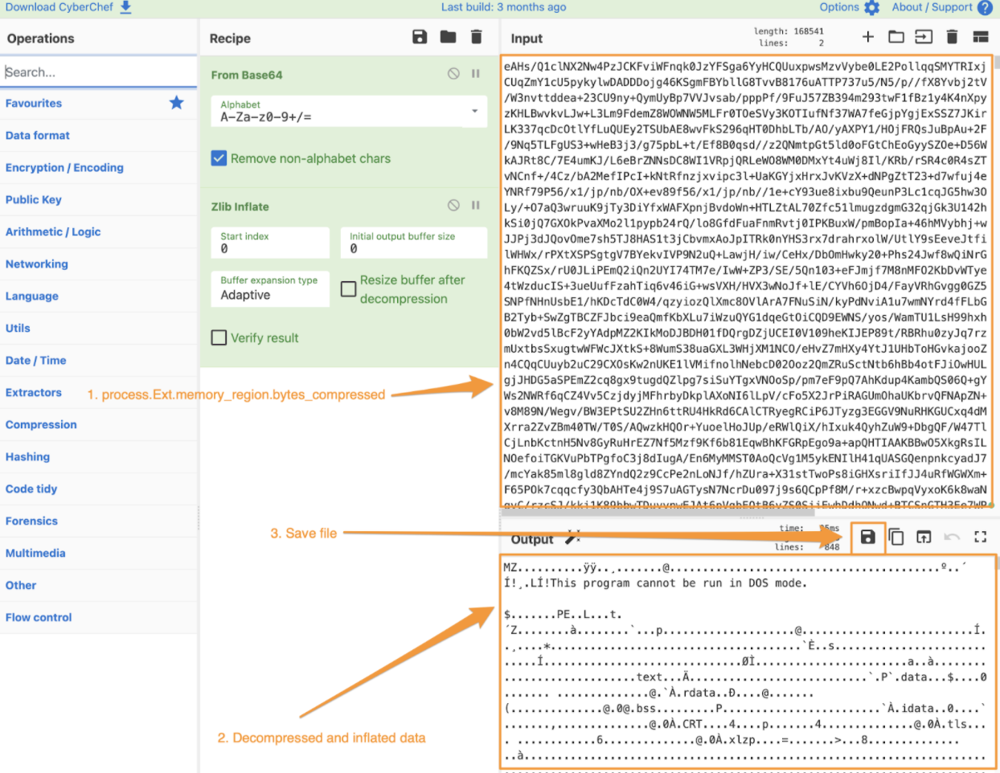

Running the `file` command, we can see that this is a Portable Executable (PE) file that can be analyzed by a malware
reverse engineer (RE).

```text title="Using the file command to validate the file type"
$ file beacon.exe

beacon.exe: PE32 executable (GUI) Intel 80386 (stripped to external PDB), for MS Windows
```

While an RE can identify a tremendous amount of information, let's explore what additional information a non-RE can
obtain from this file.

## Next Steps

In the next [release](../03.extracting-cobalt-strike-beacon/article.md), we'll use the beacon that we've just collected
and extract its configuration. With this information, we'll be able to identify other important elements such as license
identifications, watermarks, and atomic indicators.
