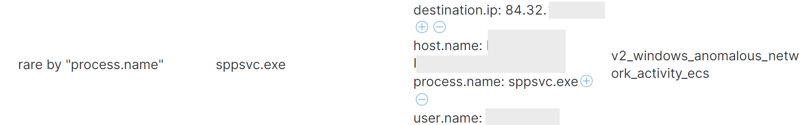
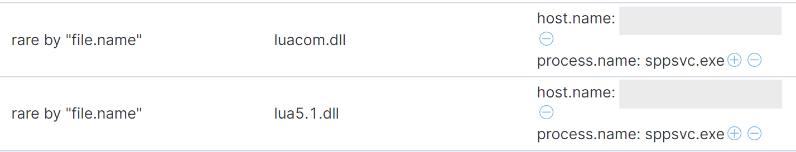

## Introduction

Machine learning detections are a powerful tool for detecting emerging threats when we don't yet know what we are looking for. The power of anomaly detection is the ability to detect and provide early warning on new threat activity for which rules, indicators, or signatures are not yet available. Let's look at a recent example. In this case study, ML finds a malware [sample](https://www.virustotal.com/gui/file/31d765deae26fb5cb506635754c700c57f9bd0fc643a622dc0911c42bf93d18f/) with a creation date of January 9 and a first seen date (on VirusTotal) of February 26, the same day as the Twitter discussion, a period of 46 days. At the time of this writing, approximately half of the engines on VirusTotal are detecting this sample, so dwell time may be ongoing for some targets. Using ML-based anomaly detection, we can shrink the dwell time for this malware persistence mechanism from 46 days to less than 1 day! In most cases, if the ML models were already running when this sample executed, an anomaly would have surfaced in as little as 16 minutes.

## Case Study: Malware Detection by an Unsupervised Machine Learning Job

On February 26, some discussion took place about a fresh malware sample that was not yet detected. While attribution has not yet been established, at the time of this writing, there is some consensus that the sample appears to be part of a campaign targeting certain users and organizations in Ukraine. The sample took the form of a .msi file - a package format used by the Windows installer. The name of the file, qwerty.msi, is the name of a freeware utility that can view and edit msi files. Like most .msi files, this file is executed by the Windows installer in ```C:\Windows\system32\msiexec.exe```. For a malware delivery system, this is a pretty good way of blending in for a malware delivery system because the Windows Installer runs hundreds of thousands of times per day on even a small Windows fleet and may execute millions of times per day on larger fleets.

On execution, the dropper creates a subdirectory named ```C:\ProgramData\.security-soft\``` and writes several files. The persistence mechanism consists of an unsigned Windows binary and a set of Lua files. The Windows binary is named ```sppsvc.exe```, the same name as a core Windows process, the Microsoft Software Protection Platform Service, which executes at least fourteen thousand times per day on even a small Windows fleet.

The C2 (command and control) server is filtering incoming connections at the time of this writing, but the ```sppsvc.exe process```, running from ```C:\ProgramData\.security-soft\```, attempts to open a TCP socket to destination port 80 at an IP address that resolves to a hosting provider in Lithuania. This behavior is unusual because the Software Protection Service process does not normally make outbound network calls, so this produces an anomaly detection score, created by the ```windows_anomalous_network_process machine``` learning job, which can be turned into an alert by a shipping machine learning package.



Figure 1. A machine learning job detects anomalous network activity

This ML job, which looks for unusual network activity by process name, was suggested by one of our user organizations who use the technique to hunt for emerging threats. It has performed well as the thesis for a machine learning job. These anomalous network events can also be turned into alerts with the corresponding alert rule ```Anomalous Windows Network Activity.```

In addition, the image loading events are unusual for this process name. The Windows Software Protection Service routinely loads two core Windows DLLs, neither of which resemble the LUA DLLs used by this persistence mechanism. These DLL (dynamically linked library) load events can also be turned into alerts with an additional machine learning job.



Figure 2. A machine learning job detects anomalous DLL activity

To alert on the DLL activity, we could run the rare function on the names of DLL files being loaded in image loading events. Additional anomaly detection techniques for DLLs can include a rare process or hostname for a particular DLL name. DLL image files, like executable files, are often digitally signed, and unusual image signer names may also be a useful detection. This is an area of active research and we plan to release a set of machine learning jobs for anomalous Windows DLL activity in the future. In the meantime, unusual DLLs can be found by something as simple as running the rare function on the image file name. In the Elastic stack, DLL image file name values are in the fields ```dll.name``` and ```dll.pe.original_file_name``` in Windows Endpoint events and in the fields ```file.name```and ```file.pe.original_file_name``` in Sysmon events.

If you are ingesting network events and the C2 connected, you might also see an alert from the network anomaly ML package, which I wrote about in a previous [blog](https://www.elastic.co/blog/detecting-unusual-network-activity-with-elastic-security-and-machine-learning). The network package might generate alerts for traffic to an unusual destination country, depending on normal geographic behavior, or a spike in denied network access events if the C2 packets were being blocked by a network device that is shipping logs.